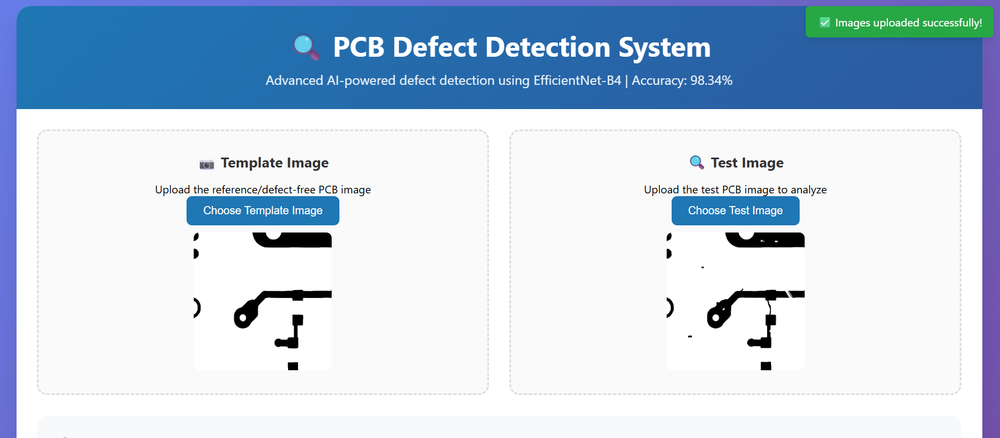
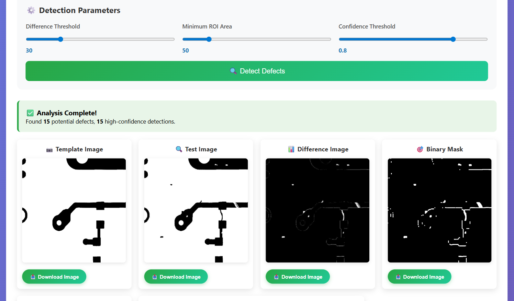
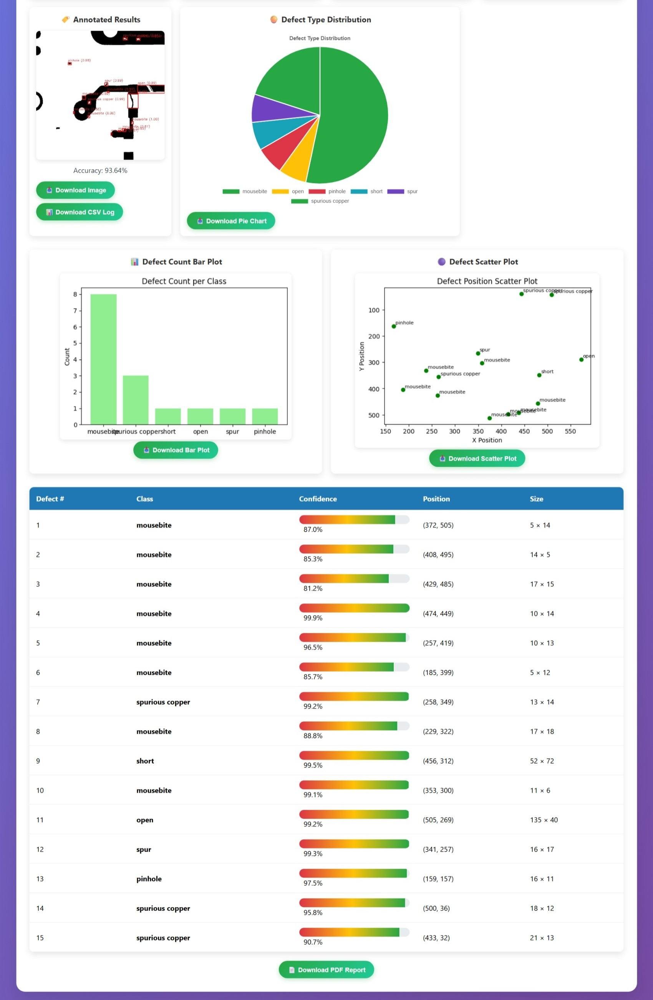
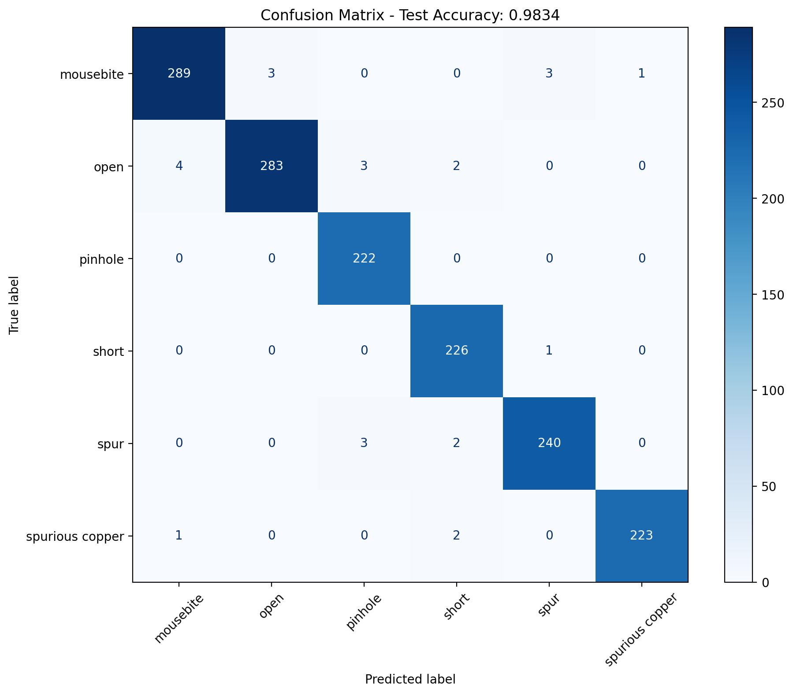
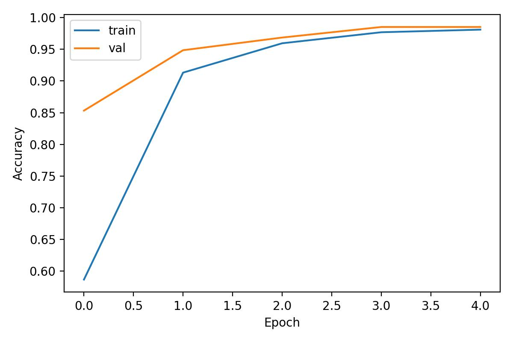
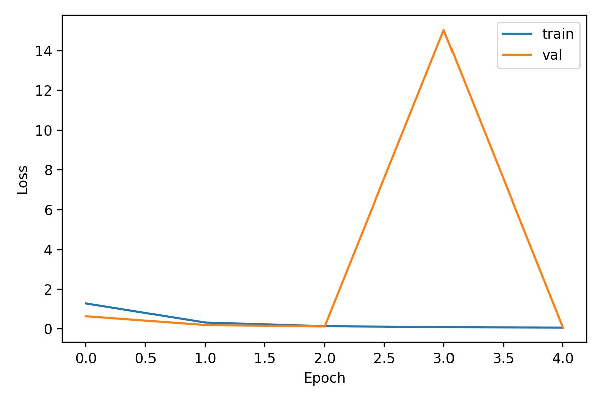

# 🔍 CircuitGuard: PCB Defect Detection System

A comprehensive deep learning system for automated PCB defect detection using EfficientNet-B4 and computer vision techniques.

<table>
  <tr>
    <td align="center">
      
      <p>Template Image</p>
    </td>
    <td align="center">
      
      <p>Test Image</p>
    </td>
  </tr>
</table>


## 🚀 Features

- **Automated Defect Detection**: Identifies 6 types of PCB defects (open, short, mousebite, spur, pinhole, spurious copper)
- **Real-time Processing**: Web interface for instant defect analysis
- **High Accuracy**: 98.34% test accuracy with EfficientNet-B4 model
- **Export Capabilities**: Download annotated images and CSV prediction logs
- **Interactive UI**: User-friendly web interface with parameter controls

## 📁 Project Structure

```
PCBDEFECT_DETECTION/
├── data/                          # Dataset (DeepPCB format)
│   ├── group00041/               # Sample group 1
│   ├── group12000/               # Sample group 2
│   └── ...
├── src/                          # Source code
│   ├── preprocessing.py          # Image preprocessing pipeline
│   ├── build_dataset.py         # Dataset creation and splitting
│   ├── train_efficientnet_b4.py  # Model training script
│   ├── evaluate_model.py        # Model evaluation
│   └── evaluate_rois.py          # ROI evaluation
├── templates/                    # Web interface
│   └── index.html               # Main UI
├── web_app.py                   # Flask web application
├── requirements.txt             # Python dependencies
├── dataset/                     # Generated training data
├── training_outputs/            # Model checkpoints and plots
├── evaluation_outputs/          # Test results
└── preprocess_example/          # Sample preprocessing outputs
```

## 🛠️ Installation

### Prerequisites
- Python 3.8+
- CUDA-compatible GPU (recommended)

### Setup
1. **Clone the repository**
   ```bash
   git clone <repository-url>
   cd PCBDEFECT_DETECTION
   ```

2. **Create virtual environment**
   ```bash
   python -m venv venv
   venv\Scripts\activate  # Windows
   # or
   source venv/bin/activate  # Linux/Mac
   ```

3. **Install dependencies**
   ```bash
   pip install -r requirements.txt
   ```

4. **Prepare dataset**
   ```bash
   python src\build_dataset.py --data-root data --out-root dataset
   ```

5. **Train model**
   ```bash
   python src\train_efficientnet_b4.py --data dataset --out training_outputs --epochs 20
   ```

6. **Run web application**
   ```bash
   python web_app.py
   ```

   RUN  :- venv\Scripts\python.exe web_app.py

## 🎯 Usage

### Web Interface
1. Open browser to `http://localhost:5000`
2. Upload template and test images
3. Adjust parameters (threshold, min area, confidence)
4. Click "Detect Defects"
5. Download annotated images and CSV logs






### Command Line
```bash
# Preprocessing
python src\preprocessing.py -t template.jpg -s test.jpg -o output

# Training
python src\train_efficientnet_b4.py --data dataset --epochs 20

# Evaluation
python src\evaluate_model.py --data dataset --model training_outputs\model_best.pth
```

## 📊 Model Performance

- **Test Accuracy**: 98.34%
- **Per-class Performance**:
  - mousebite: 97.64%
  - open: 96.92%
  - pinhole: 100.00%
  - short: 99.56%
  - spur: 97.96%
  - spurious copper: 98.67%
  

## 🔧 Parameters

### Preprocessing
- `thresh`: Difference threshold (default: 30)
- `min_area`: Minimum ROI area (default: 50)
- `conf_thresh`: Confidence threshold (default: 0.6)

### Training
- `epochs`: Training epochs (default: 20)
- `batch_size`: Batch size (default: 32)
- `lr`: Learning rate (default: 1e-4)
- `img_size`: Input image size (default: 128)

## 📈 Outputs

### Training
- `model_best.pth`: Best model checkpoint
- `loss_curve.jpg`: Training/validation loss
- `accuracy_curve.jpg`: Training/validation accuracy
- `confusion_matrix.jpg`: Test set confusion matrix

<table>
  <tr>
    <td align="center">
      
      <p>Accuracy Curve</p>
    </td>
    <td align="center">
      
      <p>Loss Curve</p>
    </td>
  </tr>
</table>


### Web App
- Annotated images with bounding boxes
- CSV logs with prediction details
- Processing time metrics

### PCB Report File link :  
https://1drv.ms/b/c/c76b039bc7fe048f/EWffnzlXd5NAsjYGdhdAt80BBWRH-8QjBns4HNNX5lenrQ?e=T2E0Er

## 🐛 Troubleshooting

### Common Issues
1. **Model not loading**: Ensure `training_outputs/model_best.pth` exists
2. **CUDA errors**: Install PyTorch with CUDA support
3. **Memory issues**: Reduce batch size or image size
4. **Import errors**: Check all dependencies are installed

### Performance Tips
- Use GPU for faster training and inference
- Adjust batch size based on available memory
- Use smaller image sizes for faster processing

## 📝 License

This project is for educational and research purposes.

## 🤝 Contributing

1. Fork the repository
2. Create a feature branch
3. Commit changes
4. Push to branch
5. Create Pull Request

## 📞 Support

For issues and questions, please create an issue in the repository.


