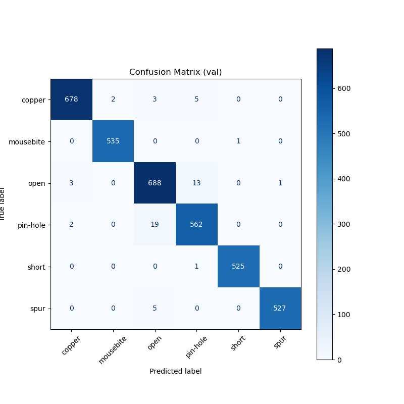
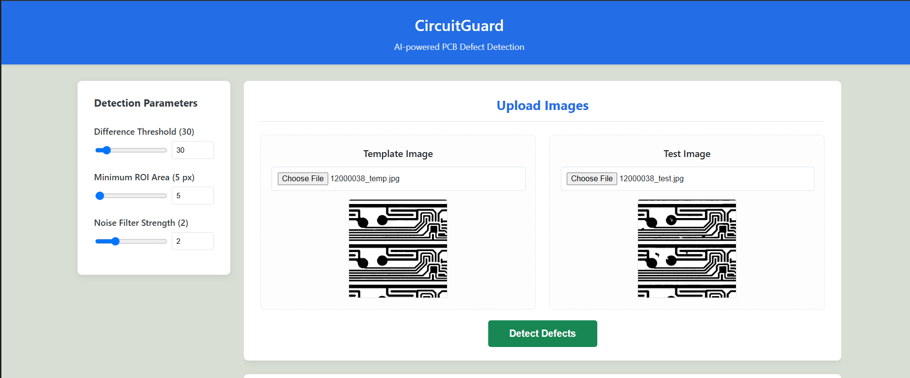

# CircuitGuard: AI-Powered PCB Defect Detection

CircuitGuard is a full-stack web application designed for automated detection and classification of defects on Printed Circuit Boards (PCBs). It uses computer vision to compare a "test" image against a "template" image and employs a deep learning model to classify any found anomalies.

The application provides a web-based user interface for uploading images, visualizing results, and generating detailed PDF reports.

### ✨ Features

* **AI-Powered Classification:** Uses a pre-trained **EfficientNet-B4** model (98% accuracy) to classify 6 types of PCB defects (short, spur, open, copper, mousebite, pin-hole).
* **Web Interface:** A clean, responsive UI built with HTML, CSS, and JavaScript for uploading images and viewing results.
* **Adjustable Parameters:** Users can fine-tune the detection pipeline by adjusting the Difference Threshold, Minimum Defect Area, and Noise Filter Strength.
* **Rich Result Visualization:** Displays the final annotated image and three server-generated summary charts (Bar, Pie, Scatter).
* **Professional PDF Reporting:** Dynamically generates a multi-page PDF report on the backend, including all images, charts, and a detailed defect summary.
* **Data Export:** Allows users to download the annotated image, the CSV log of defects, and the full PDF report.

---

### 🛠️ Tech Stack & Architecture

This project uses a modular client-server architecture.


* **Backend:**
    * **Framework:** **Flask** (Python)
    * **AI/Deep Learning:** **PyTorch** & **Timm** (for EfficientNet-B4)
    * **Computer Vision:** **OpenCV** (for image subtraction, thresholding, contours)
    * **Graphing:** **Matplotlib** (for server-side chart generation)
    * **PDF Generation:** **fpdf2** (for professional, backend-generated reports)

* **Frontend:**
    * **Structure:** **HTML5**
    * **Styling:** **CSS3**
    * **Interactivity:** **JavaScript** (using `fetch` for API calls)

---


``` bash
circuitguard/
├── app.py                      # Main Flask application, starts the server
├── requirements.txt            # Python dependencies

├── models/
│   └── final_model.pth         # The trained EfficientNet-B4 model

├── services/
│   ├── defect_service.py       # Core logic (OpenCV & PyTorch pipeline)
│   └── report_service.py       # PDF generation logic (fpdf2)

├── controllers/
│   └── detection_routes.py     # Flask API endpoints (/api/detect, /api/download_report)

├── static/
│   ├── script.js               # Frontend JavaScript (API calls, UI logic)
│   └── styles.css              # All CSS for styling

├── templates/
│   └── index.html              # The main HTML file for the UI

└── src/                        # Data processing & model training scripts
    ├── eda.py
    ├── preprocess.py
    ├── validate_dataset.py
    ├── labeled_dataset.py
    ├── split_rois.py
    ├── train_model.py
    ├── evaluate_model.py
    └── defect_classify.py 
```


### 🚀 Getting Started

#### 1. Prerequisites

* Python 3.9+
* `pip`

#### 2. Installation

1.  **Clone the repository:**
    ```bash
    git clone https://github.com/k4rthik14/circuitguard.git
    cd circuitguard
    ```

2.  **Create a virtual environment:**
    ```bash
    python -m venv venv
    source venv/bin/activate  # On Windows: venv\Scripts\activate
    ```

3.  **Install the required packages:**
    ```bash
    pip install -r requirements.txt
    ```

#### 3. Usage

1.  **Run the Flask application:**
    ```bash
    python app.py
    ```

2.  **Open the application:**
    Open your web browser and go to:
    `http://127.0.0.1:5000`

---

### 📦 Core Pipeline (`services/defect_service.py`)

The defect detection and classification pipeline is a two-stage process:

1.  **Stage 1: Defect Detection (OpenCV)**
    * Loads the template and test images as grayscale PIL images.
    * Converts them to NumPy arrays and resizes the test image to match the template.
    * Performs `cv2.absdiff` to get the raw difference image.
    * Applies Otsu's thresholding (`cv2.threshold`) to create a binary mask.
    * Cleans the mask using morphological operations (`cv2.morphologyEx`).
    * Finds all contours with `cv2.findContours`.

2.  **Stage 2: Defect Classification (PyTorch)**
    * Filters contours by a minimum area.
    * For each valid contour, it crops the Region of Interest (ROI) from the *original* test image.
    * Loads the pre-trained `EfficientNet-B4` model (`final_model.pth`).
    * The ROI is resized, transformed, and passed to the model for inference.
    * The model returns a class label (e.g., 'short', 'spur') and a confidence score.
    * The final annotated image is drawn using `cv2.rectangle` and `cv2.putText`.

---

### 🔬 Model Training Pipeline (The `src/` Directory)

This repository includes the complete machine learning pipeline used to create the `final_model.pth`.  
All scripts inside the `src/` directory are meant for **data preprocessing, model training, fine-tuning, and evaluation**, not for running the web application.

- **validate_dataset.py**  
  Checks the raw dataset for missing or corrupted files and generates a clean, validated file index.

- **labeled_dataset.py**  
  Loads the ground-truth annotation files and crops the labeled defect ROIs (Regions of Interest) from the test images.  
  Each cropped ROI is automatically sorted into its corresponding defect class folder (e.g., *open*, *short*, *spur*, etc.).

- **split_rois.py**  
  Randomly splits the labeled ROI images into **train** and **validation** sets to prepare balanced datasets for training.

- **train_model.py**  
  Loads the training and validation datasets, applies data augmentation techniques (rotations, flips, normalization), and trains the EfficientNet-B4 classifier.  
  The script automatically saves the **best-performing model checkpoint** based on validation accuracy.

- **evaluate_model.py**  
  Loads the final trained model and evaluates it on a separate held-out test set.  
  Generates the **confusion matrix**, **classification report**, and verifies the model’s accuracy (≈98%).

  ### 📊 Model Performance
Our EfficientNet-B4 model achieved **98% accuracy** on the test set.


*Figure 1: Confusion Matrix showing robust classification across all 6 defect types.*


### 🌐 API Endpoints (`controllers/detection_routes.py`)

The backend exposes two main API endpoints:

* **`POST /api/detect`**
    * **Purpose:** Runs the main analysis and returns JSON data for the web UI.
    * **Form Data:** `template_image`, `test_image`, `diffThreshold`, `minArea`, `morphIter`.
    * **Returns:** A JSON object containing:
        * `annotated_image_url`, `diff_image_url`, `mask_image_url` (as Base64 strings).
        * `bar_chart_url`, `pie_chart_url`, `scatter_chart_url` (as Base64 strings).
        * `defects`: A list of defect objects with coordinates, labels, and confidence.

* **`POST /api/download_report`**
    * **Purpose:** Runs a full analysis and generates a downloadable multi-page PDF report.
    * **Form Data:** `template_image`, `test_image`, `diffThreshold`, `minArea`, `morphIter`.
    * **Process:** Re-runs the analysis, calls `create_pdf_report` from `report_service.py`, and passes all the raw data (PIL images, defect list, Matplotlib figures) to it.
    * **Returns:** A `application/pdf` file as an attachment.
### 📸 User Interface

The web interface allows users to easily upload PCB images and view defect predictions in real-time.


*Figure 2: The CircuitGuard Web Dashboard displaying detected defects.*
